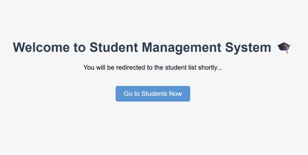
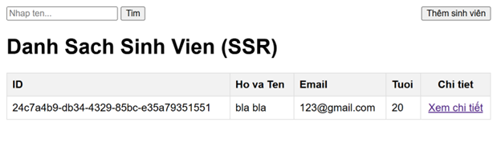
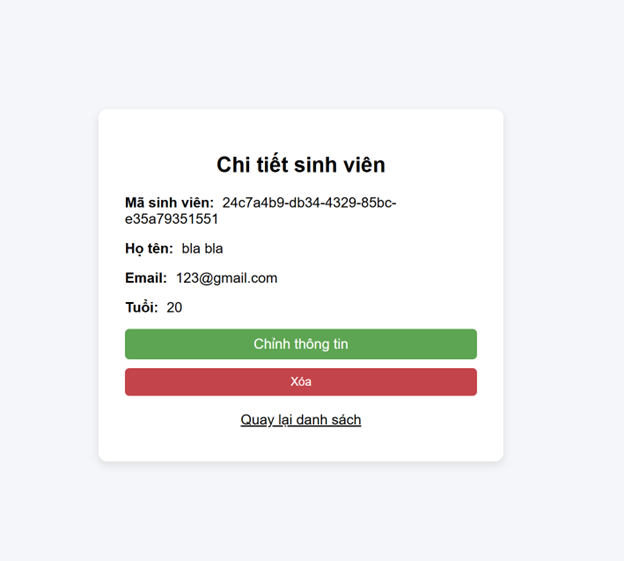
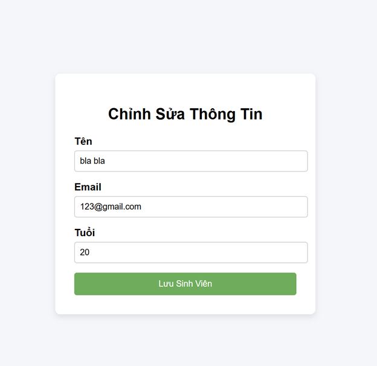
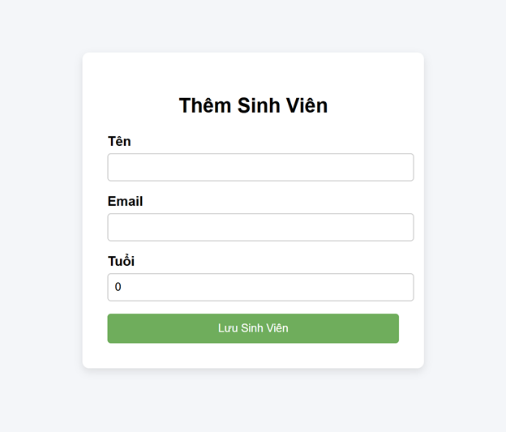

- ### Thành viên nhóm

        | Họ và tên          | MSSV    |
        | ------------------ | ------- |
        | Đặng Thành Duy Đan | 2310615 |
        | Trần Tiến Đạt      | 2310707 |

- ### Public URL: https://cnpmnc-lab-a9wk.onrender.com/

- ### Giới thiệu

      Ứng dụng sử dụng cơ sở dữ liệu PostgreSQL được lưu trữ trên Supabase và kết nối thông qua Supabase Session Pooler để quản lý kết nối cơ sở dữ liệu một cách hiệu quả.

      Thông tin cấu hình và tài khoản database được cung cấp thông qua các biến môi trường, bao gồm:

      POSTGRES_DB_URL

      POSTGRES_USER

      POSTGRES_PASSWORD

      Cách làm này giúp đảm bảo tính bảo mật và linh hoạt khi triển khai ở nhiều môi trường khác nhau như môi trường phát triển cục bộ (local) hoặc các nền tảng đám mây (cloud).

- ### Hướng dẫn chạy dự án

      1. Clone repository
         git clone https://github.com/bluebird3012/cnpmnc-lab.git
         cd cnpmnc-lab
      2. Build Docker image

      Đảm bảo rằng Docker đã được cài đặt và đang chạy trên máy của bạn.

      docker build -t student-management .
      3. Chạy Docker container
         docker run -p 8080:8080 \
         -e POSTGRES_DB_URL=db_url \
         -e POSTGRES_USER=db_username \
         -e POSTGRES_PASSWORD=db_password \
         -e PORT=8080 \
         student-management
      4. Truy cập ứng dụng

      Sau khi container khởi động thành công, mở trình duyệt và truy cập:

      http://localhost:8080

      Lưu ý
      POSTGRES_DB_URL phải có định dạng như sau:

      jdbc:postgresql://aws-1-ap-northeast-1.pooler.supabase.com:5432/postgres

- ### Trả lời câu hỏi lý thuyết Lab
  1.  **Tại sao Database lại chặn thao tác Insert trùng ID và báo lỗi `UNIQUE constraint failed`?**

            Hệ quản trị cơ sở dữ liệu chặn thao tác này vì trường `id` được định nghĩa là **Khóa chính (PRIMARY KEY)**. Ở mức hệ thống, Khóa chính tự động áp đặt ràng buộc **duy nhất (UNIQUE)**. Việc cơ chế Storage Engine bắt lỗi và rollback giao dịch này nhằm 2 mục đích kỹ thuật:
            1. **Bảo vệ Tính toàn vẹn thực thể (Entity Integrity):** Đảm bảo mỗi bản ghi (sinh viên) là định danh.
            2. **Ngăn chặn Nhập nhằng dữ liệu (Data Ambiguity):** Nếu cho phép trùng ID, các câu lệnh DML (`UPDATE`, `DELETE`) sau này sẽ không thể xác định chính xác mục tiêu, dẫn đến nguy cơ sửa/xóa nhầm dữ liệu diện rộng.

  2.  **Thử Insert sinh viên bỏ trống cột `name` (để NULL). Database có báo lỗi không? Sự thiếu chặt chẽ này ảnh hưởng gì khi code Java?**

            SQLite không báo lỗi và vẫn cho phép thành công. Nguyên nhân là do câu lệnh DDL khởi tạo bảng `students` thiếu ràng buộc `NOT NULL` ở cột `name` (`name TEXT`). Khi Spring Data JPA thực hiện ORM (Object-Relational Mapping) để kéo bản ghi này lên bộ nhớ, thuộc tính `name` của đối tượng `Student` sẽ bị gán thành `null`. Bất kỳ lời gọi hàm nào can thiệp vào thuộc tính này đều sẽ kích hoạt ngoại lệ **`NullPointerException` (NPE)** tại thời điểm Runtime (Runtime Exception), làm crash luồng thực thi và trả về lỗi HTTP 500 Internal Server Error cho Client.

  3.  **Tại sao mỗi lần tắt ứng dụng và chạy lại, dữ liệu cũ trong Database lại bị mất hết?**

            Vì thuộc tính `spring.jpa.hibernate.ddl-auto` đang được cấu hình là `create`, khiến Hibernate tự động xóa (DROP) và tạo lại (CREATE) toàn bộ bảng mỗi khi khởi động ứng dụng.

            Cách khắc phục: Đổi giá trị thành `update` hoặc `none`.

- ### Screenshot for Lab 4 Module

      - Homepage:

  

      - Students page:

  

      - Student’s detail page:

  

      - Modify Student Info page:

  

      - Add new student page:

  
